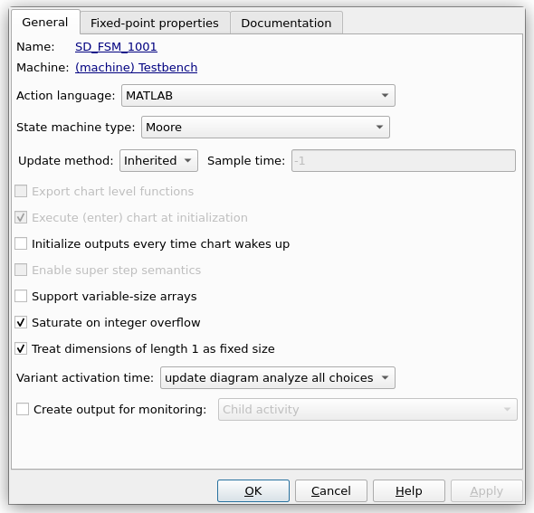

# Computer Architecture Design

Digital Design and Computer Architecture Examples From Book "Digital Design and Computer Architecture: ARM Edition"  
Using **MATLAB/SimuLink HDL Toolkit**.

### Notes
- Set Model Settings > HDL Code Generation > Global Settings > Ports > Minimize Clock Enables

- Moore FSM Chart Settings

  

